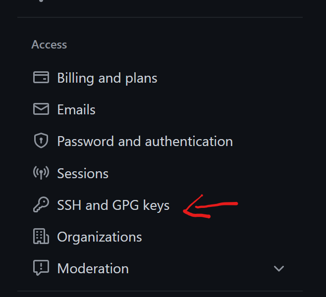
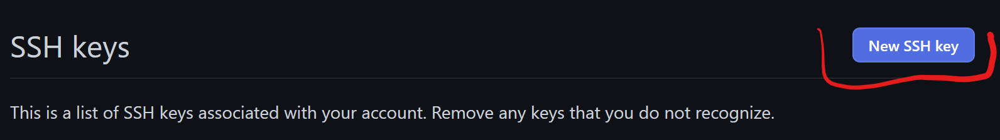
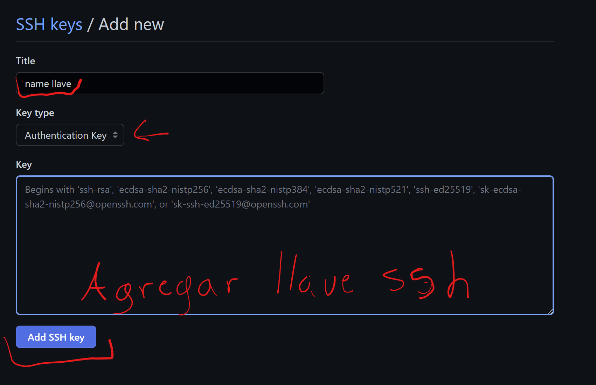
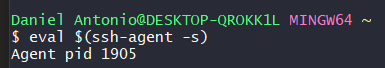

# Como configurar multiples ssh keys para repositorios

### Primer paso es generar nuestras shh

- nos colocamos en la carpeta ```~/.ssh```

~~~ 
IMPORTANTE 😃 Si la carpeta .shh no existe la creamos 
~~~

``` ~/ 👉 Ruta de nuestro usuario ```

- Una vez posicionado en la carpeta realizamos lo siguiente

### Generar llave ssh

Ejecutamos ```ssh-keygen -t rsa -b 4096 -C  email@example.com```
( Cambiar el email@example.com por el de tu cuenta de Github)

- Ingresamos un nombre a nuestra llave ssh en nuestro caso ```id_rsa_personal```


- Nos pedirá una contraseña y verificación de la misma. Una vez finalizado ese paso nos generara dos archivos

```
 id_rsa_personal 👈 Jamas debes compartir esta llave
 id_rsa_personal.pub 👈 Esta es nuestra llave publica
```

## Ahora toca agregar nuestra llave ssh a Github

- Primero tenemos que ir a settings en Github


- Despues nos pasamos a registrar la llave ssh



- Seleccionamos new ssh key (nueva lave ssh)



- Agregamos nuestra ssh la que aparece en nuestros archivo ```id_rsa_personal.pub```
- Nos solicitara pedirá titulo de en mi caso ```personla```



- Una vez guardado nos regresaremos a la ```terminal```

## Agregamos la llave ssh a nuestra computadora

- Primero ejecutamos el siguiente comando para verificar que el agente esta en ejecución

```eval $(ssh-agent -s)```



Si el resultado es parecido al de la imagen todo esta bien

- A continuación ejecutamos el siguiente 
```
ssh-add ~/.ssh/name_ssh_key 👈 cambiar por el nombre que colocaste a tu llave ssh

Ejemplo:
ssh-add ~/.ssh/id_rsa_personal
```
- Nos solicitara la contraseña que colocamos y en la llave, con este paso agregamos la llave ssh privada a nuestra computadora.

````
Realiza lo mismo con tantas llaves ssh requieras
````

# Configurar el archivo para trabajar multiples llaves

- En la misma ruta donde creamos nuestras llaves ssh crearemos un archivo con el nombre  ```confing```

Agregamos las siguientes lineas y mantener la indexación 

Esto es para github
````
Host github.com
    HostName github.com
    User git
    IdentityFile ~/.ssh/id_rsa_personal
````

Importante a tomar en cuenta

````- Host```` 
<span style="color:red"> github.com </span>```` (Este nombre es el que gustes pero con este tendras que clonar tu repositorio)
le coloque```` <span style="color:red"> github.com </span>````por que es mas facil para mi recordar y es como default ya que asi lo coloca github````

```` Ejemplo en mi caso: git clone git@````<span style="color:red"> github.com </span> ```:danielAntonio3/config-multiple-ssh-keys.git```

````Ejemplo: Si colocas````<span style="color:red">personal.github.com </span>````cuando clones un repositorio tienes que colocar
git clone git@````<span style="color:red">personal.github.com </span>````:danielAntonio3/config-multiple-ssh-keys.git````

````
- IdentityFile ~/.ssh/id_rsa_personal
Aqui tienes que color el nombre que le colocaste a tu ssh key en mi aso fue id_rsa_personal
````

- Verificamos que todo este ok! con el siguiente comando
```
ssh -T git@github.com (Despues del @ colocamos el nombre que colocamos en host)
```
nos solicitara la contraseña y una vez colocado si nos sale el siguiente mensaje esta listo para poder usar la llave ssh


Referencias si causan alguna otra duda

[link 1](https://medium.com/dottech/c%C3%B3mo-tener-m%C3%BAltiples-claves-ssh-para-tus-cuentas-de-github-o-bitbucket-398bc508ce65)

[link 2](https://blog.linuxitos.com/post/anadir-varios-usuarios-de-gitlab-y-github-fedora)

[link 3](https://qastack.mx/programming/3225862/multiple-github-accounts-ssh-config)
